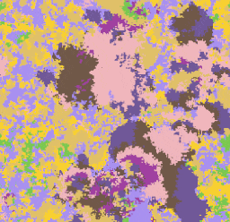

# poke-fighting-rust

Rust project that simulates a grid of Pokémon fighting with each other. Each Pokémon type is a pixel on the grid and is represented by a color.

Here is an example of the program running. Each color is a type, for example the yellow color represents Lightning type (for example Pikachu).



Every frame an attack is done by a Pokémon that will pick a neighbour that is weak to the attacker's damage,
if that neighbour faints they will turn into a pokemon of the same type as the attacker.

Some Pokémon types do more or less damage to other types, which is what this is trying to simulate.

[Twitter thread](https://twitter.com/olafurw/status/1522273899441967104) with more info and GIFs

## Other Types

The repository also has configurations for Rock/Paper/Scissors, Street Fighter (Super Street Fighter 4 Arcade Edition v2012) and Red/Green/Blue color values. 

You can create your own as long as there is a way to resolve a fight between two fighters, be it a damage table like Pokémon or a function that resolves damage between two fighters like in the Red/Green/Blue case.

## Build

```
cargo run // Runs with default config values

cargo run -- -c config.json // Uses config values
```

Depends on `nannou` for the Window
