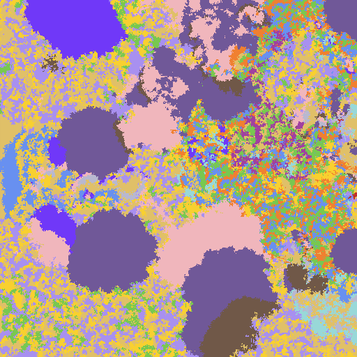

# poke-fighting-rust

Rust project that simulates a grid of Pokémon fighting with each other.

Each Pokémon type is a pixel on the grid and is represented by a color.

Every frame an attack is done by a Pokémon that will pick a random neighbour, 
if that neighbour faints they will turn into a pokemon of the same type as the attacker.

Some Pokémon types do more or less damage to other types, which is what this is trying to simulate.

[Twitter thread](https://twitter.com/olafurw/status/1522273899441967104) with more info and GIFs

## Build

```
cargo r --release
```

Depends on `nannou` for the Window

## Example Frame

Here the purple Pokémon (Ghost type) have a few large clusters and are slowly taking over the lower region.
But a small brown section (Dark type) has started to invade one of them


